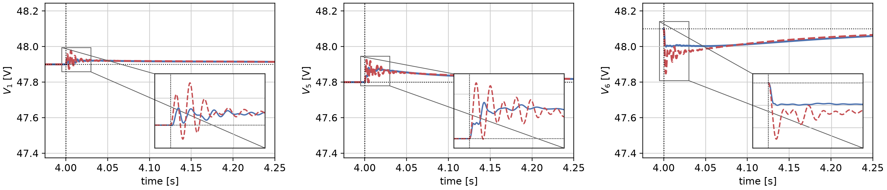
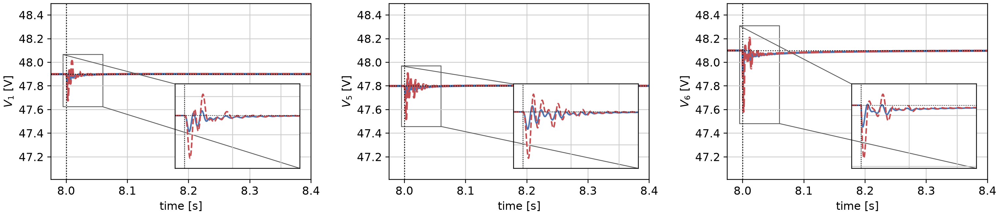
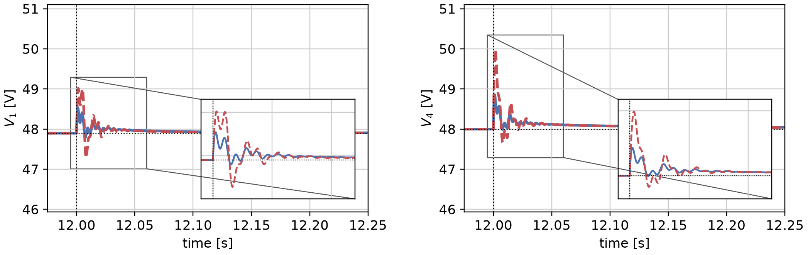

# PnPdistributedPB

This repository accompanies the paper **"Distributed Performance Boosting through Neural Control for Plug-and-Play Networks"** by Danilo Saccani, Leonardo Massai and Giancarlo Ferrari-Trecate.

It implements a distributed neural performance booster for a pre-stabilized DC microgrid with plug-and-play (PnP) topology changes and ZIP loads. The neural layer combines gain-constrained **Recurrent Equilibrium Networks (RENs)** with a bounded **Magnitude-and-Direction (MAD)** readout. It generates a boosting input from causally reconstructed residuals while a passivity-based primary controller regulates the microgrid.

The repository includes the selected controller, a resumable training checkpoint, and two entry points: one to reproduce the representative figures and one to continue training.

## Features

- Six-DGU DC microgrid benchmark with nonlinear ZIP loads and a fixed passivity-based primary controller.
- Distributed REN/MAD controller with topology-dependent local gains and PnP certificate updates.
- Nonlinear ZIP plant simulations with a topology-dependent linear internal model for residual reconstruction.
- Full backpropagation through physical rollouts, baseline calibration on identical scenarios, and balanced training across perturbations, load changes, plug-in and unplug events.
- Numerical checks of the realized local REN and network certificates before validation.
- PDF/PNG voltage figures with transient zooms, plus optional boosting-action plots.

## Installation

Clone the repository and create a Python environment:

```bash
git clone https://github.com/DaniloSaccani/PnPdistributedPB.git
cd PnPdistributedPB
python3.13 -m venv .venv
source .venv/bin/activate
```

On Windows, activate the environment with `.venv\Scripts\activate`.

Install the packages used in the reference environment:

```bash
python -m pip install numpy==2.4.4 torch==2.11.0 matplotlib==3.11.2
```

Both entry points run on CPU. Controller calculations and physical simulations use double precision (`float64`).

## Repository structure

```text
PnPdistributedPB/
├── main_PnP_validation.py     # Replay baseline/PB and generate the figures
├── main_PnP_training.py       # Continue physical closed-loop training
├── README.md
├── src/
│   ├── __init__.py
│   ├── plant.py              # DGU/line parameters, primary controller, ZIP plant
│   ├── controller.py         # REN, MAD, interconnections, certificates and PnP
│   ├── simulation.py         # Scenarios, causal residual reconstruction, metrics
│   ├── training.py           # Loss, baseline calibration, selection and Adam
│   ├── settings.py           # Numerical parameters for a new training run
│   ├── model_io.py           # Checkpoint loading and saving
│   └── plotting.py           # Voltage/control figures and transient zooms
├── figure/                   # Three final voltage figures, each in PDF and PNG
└── models/
    ├── controller.pt         # Selected controller used for the figures
    └── training_state.pt     # Last complete epoch, with Adam and RNG state
```

The selected checkpoint is epoch 144 of the final continuation stage. The training-state checkpoint contains epoch 146 and retains epoch 144 as its best model. Configuration and training metadata are stored inside the checkpoints; defaults for a new optimizer are collected in [`src/settings.py`](src/settings.py).

## Usage

### 1. Reproduce the representative figures

```bash
python main_PnP_validation.py
```

The script loads `models/controller.pt`, checks the realized certificates on the nine registered network configurations, and simulates matching primary-controller baseline and PB trajectories. It saves three voltage figures as PDF and PNG in `figure/`, replacing those six named files.

The figures have transient zooms and no title or legend. They use raw simulation samples without smoothing or decimation. In each figure, **solid blue** is PB + MAD, **dashed red** is the primary-controller baseline, and **dotted black** indicates voltage references and the event time.

Optional commands:

```bash
# Add the top legend
python main_PnP_validation.py --legend

# Also generate boosting-action figures
python main_PnP_validation.py --controls

# Validate another trained checkpoint in a separate output directory
python main_PnP_validation.py --model models/my_run/selected_controller.pt --output figure/my_run
```

### 2. Continue training

Start a new Adam optimizer from the selected controller:

```bash
python main_PnP_training.py --epochs 24 --budget-hours 2.5
```

Resume the bundled training state, including Adam moments and random-number-generator state:

```bash
python main_PnP_training.py --resume models/training_state.pt --epochs 152 --budget-hours 2.5
```

For resume, `--epochs` specifies the **total target epoch count**. The bundled state resumes after epoch 146; keeping target 152 preserves its original cosine learning-rate schedule.

Each run saves `last.pt` and `selected_controller.pt` in a new `models/training_<UTC>/` directory. The selected checkpoint is the best feasible model on the fixed training guard. The last checkpoint also stores optimizer/RNG state for continuation. The cooperative time budget is checked between complete epochs, so a run can finish before the requested epoch count.

The training recipe uses a sampling time of **50 microseconds**, prescribed network gain **gamma_R = 25**, six REN internal states and six equilibrium-network coordinates per DGU, and a local MAD MLP of dimensions **4 → 8 → 1**. Each complete epoch has six differentiable 150 ms rollouts (3000 steps) and four Adam updates. Model selection uses a fixed six-case, 500 ms guard with equal weight for the four scenario groups.

The ten independent communication weights remain frozen by default. To optimize them offline with a new optimizer:

```bash
python main_PnP_training.py --epochs 24 --budget-hours 2.5 --learn-edges
```

These commands continue an already trained controller. They do not repeat the historical adaptive search and supervised initialization that produced the bundled model.

## Representative figures

Each case is an **independent experiment**, initialized at equilibrium 25 ms before its event and simulated for 500 ms afterward. The displayed event times of 4, 8 and 12 seconds are offsets for these separate experiments. The figures show selected DGUs and portions of those simulated windows.

Click a preview to open its PDF.

### Plug-in of DGU 6

Voltages of DGUs 1, 5 and 6 when DGU 6 joins the five-DGU network.

[](figure/paper_plugin_dgu_1_5_6.pdf)

### Load change after the plug-in

Voltages of DGUs 1, 5 and 6 for a **+1.3 A** change in the constant-current component of the ZIP load at DGU 6, from 4.4 A to 5.7 A, with all six DGUs connected.

[](figure/paper_post_event_load_dgu_1_5_6.pdf)

### Unplugging of DGU 3

Voltages of DGUs 1 and 4 when DGU 3 is removed from the six-DGU network.

[](figure/paper_unplug_dgu3_dgu_1_4.pdf)

## Notes on the experiments

- The primary-controller baseline and PB use identical physical scenarios and initial conditions. The primary gains remain fixed during training and topology changes.
- Validation uses the parameters embedded in the selected checkpoint. Resume uses its saved configuration; a new optimizer uses `src/settings.py`.
- The three representative event families were included in training. Their figures demonstrate performance on those families rather than independent validation on unseen events.
- Numerical certificate checks concern the implemented fixed configurations. Sampled voltage containment is an empirical observation; it does not establish forward invariance or stability under arbitrary switching.
- Training involves full differentiation through nonlinear simulations and can be computationally expensive. Further training can change the selected weights and resulting figures.

## How to cite

If you use this repository, please cite the accompanying paper:

```bibtex
@misc{saccani2026distributed,
  title={Distributed Performance Boosting through Neural Control for Plug-and-Play Networks},
  author={Danilo Saccani and Leonardo Massai and Giancarlo Ferrari-Trecate},
  year={2026}
}
```
